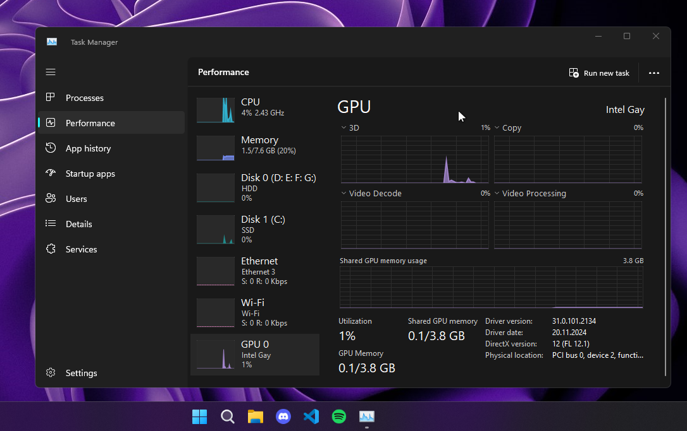

# GPU Name Changer



🚀 **GPU Name Changer** is a Python script that allows you to rename your graphics card in Windows . This is useful for aesthetic reasons, testing, or personal customization.

## 🛠 Features
✅ Detects all installed GPUs (NVIDIA, AMD, Intel, etc.)  
✅ Displays real GPU names before modification  
✅ Allows selection of a specific GPU or all GPUs for renaming  
✅ Edits the Windows Registry safely (requires admin rights)  
✅ Works with multiple GPUs (e.g., laptops with Intel + NVIDIA)  

## ⚠️ Disclaimer
> This script doesn't modify your GPU internally , you can easily go back with resinstalling the driver.
> Some Games detects it some doesn't.
> I've made this Script to only show on Device Manager, Task Manager and other because everyone can fake and lose money on pc's with fake cards.

## 📜 Requirements
- Windows  (Administrator privileges required)
- Python 3.x installed

## 🚀 Usage

### 1️⃣ Install Python (if not installed) (Optional , ONLY IF THERE'S ISSUES WHILE OPENING THE SCRIPT)
Download and install **Python 3.x** from [python.org](https://www.python.org/downloads/).


### 4️⃣ Choose the GPU and enter a new name
```
Detected GPUs:
1. NVIDIA GeForce RTX 3060
2. Intel UHD Graphics 630
0. Rename all GPUs

Enter the number of the GPU you want to rename: 1
Enter new name: Super RTX 9000
```

### 5️⃣ Restart your PC
For the changes to take effect, restart your computer. 🚀

## 🖥 Screenshot
Here's how it looks after renaming the GPU:


## 🛑 Uninstall / Restore Default Name
[ METHODS ]
1. Disable the GPU in Device Manager then Reenable it after
2. Reinstall Drivers


## ⭐ Support & Contributions
If you like this project, consider starring ⭐ the repo or contributing! Pull requests are welcome. 😃

